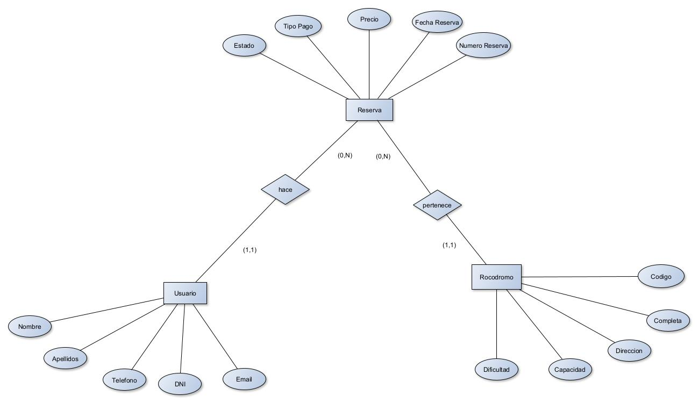

Este proyecto consta en una aplicación para gestionar los rocodromos de una ciudad en específico.
Para su puesta deberemos tener descomprimido todos los archivos o clonar el repositorio de GitHub,
y deberemos seleccionar como clase Main la clase Launcher.

Usamos varios archivos .fxml para la interfaz visual para el Usuario con las pestañas de Usuario,
Rocodromo y Reservas al igual que sus respectivos modelos en las clases de Java y sus controladores respectivamente

Para este proyecto se han usado las librerías de JavaFX, usamos también el serializador y deserializador
para guardar y cargar los archivos.